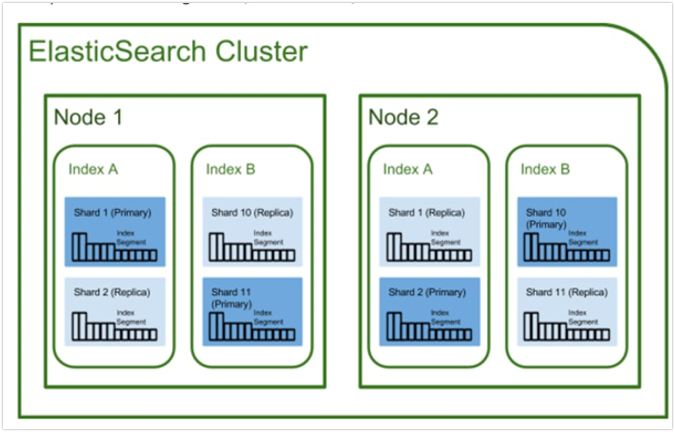

# Elasticsearch Basics

Elasticsearch is a search engine based on the Lucene library.
It provides a distributed full-text search based on a schema-free JSON documents. It is the most popular enterprise search engine.

The documents are saved in Indexes. The date itself is saved in shards.
These shards can be distributed over several nodes.
A node is an independent server in the network.
An Elasticsearch cluster consist of several Nodes. This whole architecture is shown in the Figure below.

## Node [Elasticsearch Documentation](https://www.elastic.co/guide/en/elasticsearch/reference/current/modules-node.html)

A Node is an independent Server, which is handling request in the system.
It is able to distribute request to different nodes to handle load and optimize search request.
A node can have different roles, which describes what the node can do.
The most basic roles are:

* Data Node
* Master Node
* Ingest Node

We discuss the roles and settings of Node in the chapter [PLace holder](ToSomeWhere) in more dept.

## Index [Elasticsearch Documentation](https://www.elastic.co/guide/en/elasticsearch/reference/current/docs-index_.html)

In the relational world the index would be the database.
It has a definition of the containing data-structure, the mapping.
An Index is as well a namespace, which contains one or more primary shards and can have replica shard.

The index separates the data in different domains and documents.
So you normally split your data based on the type into indexes.
But keep in mind, that each index comes with it share of shards.
For different use cases and architecture of shards, more or less shards are preferred.
This is discussed in [Place Holder](TooSomeWhere).

## Shards

A shard is in the most basic means a full-fledged Lucene search engine.
Therefore, is Elasticsearch a distributed Lucene engine.

Elasticsearch controls, for us with [Sharding and Routing](Link to sharding and routing explanation), to which shard a document is sent and saved.
In a simpler view, a shard is Bucket in which document can be saved.
Elasticsearch distributes all the Data into the different available shards
These shards get then distributed over all nodes, to share the data load and workload of the search.

## Search Tables

The search tables are the building blogs of the Lucene engine.
Each document get analyzed and its field written into an inverted index.
This index consist of the word in the document and the document number it belongs to.
With these analyses, it's much faster to find the corresponding document to a searched word.
In Elasticsearch we can control how a field is analyzed and stored in these search tables.
This is described in [Place Holder](tooooSomeWhere)
